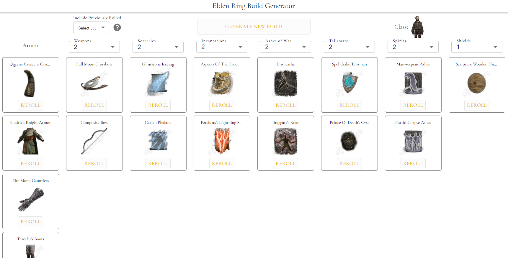

# Generate random Elden Ring builds 🤺

## Features
- Customize the number of items to generate for each category
- Reroll individual items to get the perfect build
- Control duplicate item rerolls by switching them on or off by category
- Click on each item to view its wiki page

## TODO
- Lock individual items or entire categories so they are not regenerated
- Add randomized challenge runs
- Add saving/editing builds to user account
- Generate URLs that link to a specific build
- Ability to select items from a list to put in each build slot
- Individual item stats and overall build stats
- Option to ensure Ash of War compatibility with generated weapons
- Option to force rolling a seal to use incantations (In progress)
